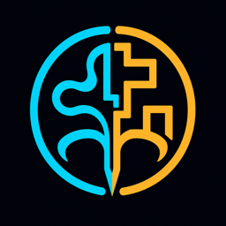

<div align="center">
  
  <h1>Rulora</h1>
  <p><strong>让模型负责理解与创造，让程序负责控制、验证与交付。</strong></p>
  <p>一套面向真实业务场景的 LLM + Program Hybrid 协同框架。</p>
  <p>
    <a href="README_EN.md">English</a> ·
    <a href="#快速开始">快速开始</a> ·
    <a href="#场景案例">场景案例</a> ·
    <a href="docs/ARCHITECTURE.md">架构</a> ·
    <a href="CONTRIBUTING.md">参与贡献</a>
  </p>
</div>

---

## Rulora 是什么

Rulora 是一套用于构建高约束 AI 工作流的开源基础框架。它不要求模型接管全部流程，
而是把开放性的理解与创作交给模型，把确定性的状态、规则和交付责任交给程序。

Rulora 将这种协作方式称为 **Hybrid 机制**：

- **模型负责开放任务**：理解自然语言、追问、提炼、结构化生成和视觉创作；
- **程序负责确定任务**：字段、状态、分支、预算、证据、Schema、质量门禁和保存；
- **数据契约连接两者**：模型只提交候选结果，程序验证通过后才允许流程前进。

> Hybrid 是 Rulora 对“模型能力与确定性程序协同”的项目术语，
> 不是某个模型、Agent 平台或图片服务的名称。

## 为什么需要它

只依赖 Prompt 的 Agent 容易出现流程漂移、字段遗漏、无限追问、成本失控和结果不可复现；
只依赖传统程序，又难以理解真实用户的自然表达，也不擅长开放式内容与视觉创作。

Rulora 在两者之间建立一份可执行契约：

```text
用户或业务事件
      ↓
模型：理解、提取、提问、生成
      ↓  候选结构化结果
Rulora：校验、状态转换、预算与证据门禁
      ↓  已批准任务
模型 / Image：完成受约束创作
      ↓  候选交付物
Rulora：质量检查、定向重试、人工接管、保存
```

## Hybrid 机制

1. **程序拥有状态**：模型不能自行宣布字段完成、跳转分支或结束流程。
2. **模型提交候选结果**：字段、报告和图片必须通过程序契约才能进入下一阶段。
3. **结论绑定证据**：重要输出可以追溯到输入字段、用户回合或上游产物。
4. **失败是显式状态**：重试、无进展、Token 预算和人工接管由程序记录。
5. **集成留在边界之外**：模型、图片、渠道与持久化由宿主通过明确接口接入。
6. **商业策略留在宿主应用**：付费、订阅和访问次数不写死在 Rulora Core 中。

## 场景案例

| 案例 | 状态 | 模型负责 | 程序负责 |
|---|---|---|---|
| [01 · 受控诊断 Agent](examples/01-guided-diagnosis/README.md) | Alpha | 理解回答、提问、提炼候选字段 | 字段、分支 Loop、无进展纠偏、Token 门禁、证据与冻结 |
| [02 · 原生报告生图](examples/02-native-image-report/README.md) | Mock 概念样例 | 生成候选报告和图片任务 | 基础字段检查、视觉叙事选择、模拟 QA 门禁 |
| [03 · 稳定生图复刻](examples/03-stable-image-reproduction/README.md) | Mock 概念样例 | 按槽位容量提供候选文案 | 字符容量检查、模拟融合与模拟像素门禁 |

案例二追求每次报告的原生视觉协同；案例三追求一个优秀设计被稳定、批量地复刻。

案例二的[完整视觉 Prompt](examples/02-native-image-report/visual-prompt.js)可作为 Provider
接入时的任务输入参考。当前仓库没有内置图片 Provider、OCR 引擎或图片编辑器；样例只用
模拟 URI 和模拟 OCR 文本演示门禁顺序，不会生成图片，也不能证明真实 OCR 或视觉质量。

这些案例说明 Hybrid 机制，并提供可运行程序和一个完整的原生报告视觉 Prompt 示例。

## 快速开始

要求 Node.js 20 或更高版本。

```bash
git clone https://github.com/Buffalo2024/rulora.git
cd rulora
npm test
```

运行三个本地示例：

```bash
npm run example:diagnosis
npm run example:native-image
npm run example:stable-image
```

示例默认使用 Mock Provider，不需要 API Key。接入真实模型时，请通过 Provider Adapter
读取环境变量，不要把密钥写入代码、Scenario 或 Prompt。

## 当前实现边界

当前 `0.1.0-alpha.1` 已实现：

- `OrchestrationMachine`：字段分支、来源回合、Token 计数、无进展纠偏、人工接管和冻结；
- `MemoryRepository`：仅用于本地演示和测试的进程内存储；
- `HybridPipeline`：带 `model` / `program` 所有权和可选验证门禁的顺序流水线；
- 三个无需 API Key 的本地示例，其中两个图片示例使用 Mock 结果。

当前尚未内置：真实模型或图片 Provider、持久化数据库适配器、OCR、确定性图片融合、
像素差异计算、并发控制、断点恢复和生产级可观测性。相关名称在架构文档中表示扩展边界，
不表示当前包已经提供对应实现。

## 安装 Core

当前 npm 包尚未发布。请先从源码运行；首个 npm 版本发布后将支持：

```bash
npm install @rulora/core
```

基础用法：

```js
const { MemoryRepository, OrchestrationMachine } = require('@rulora/core')

const machine = new OrchestrationMachine({
  repository: new MemoryRepository(),
  scenario: yourScenario,
  defaults: { tokenLimit: 12000 }
})
```

## 它如何与 OpenClaw 配合

Rulora 不是 OpenClaw 的替代品。OpenClaw 可以承担会话、工具、渠道与模型接入；
Rulora 作为确定性业务控制层，决定当前字段、状态转换、验证和交付门禁。

```text
OpenClaw / Web / 客服渠道
          ↓
    Rulora Scenario
          ↓
Model Provider ↔ Rulora Core ↔ Repository / Quality Gate
```

## 仓库结构

```text
rulora/
├─ assets/                               Logo 与联系方式占位资产
├─ docs/                                 架构、边界与发布说明
├─ examples/
│  ├─ 01-guided-diagnosis/               受控诊断 Agent
│  ├─ 02-native-image-report/             原生报告生图
│  └─ 03-stable-image-reproduction/       稳定生图复刻
├─ src/                                  通用状态机和 Hybrid Pipeline
└─ tests/                                状态、门禁和契约测试
```

## 文档导航

- [架构与核心不变量](docs/ARCHITECTURE.md)
- [OpenClaw 接入说明](docs/OPENCLAW-INTEGRATION.md)
- [发布检查清单](docs/RELEASE-CHECKLIST.md)
- [GitHub 仓库资料](docs/REPOSITORY-METADATA.md)
- [贡献指南](CONTRIBUTING.md)
- [安全策略](SECURITY.md)

## 商务与技术合作

如果你希望围绕 Rulora、场景案例或其他业务场景开展技术合作、联合开发或商务合作，请联系：

- 邮箱：`zzjeff1993.agent@gmail.com`
- 微信：扫码添加，请注明 Rulora 或合作事项

<p align="center">
  
</p>

## 许可

本仓库代码采用 [Apache-2.0](LICENSE) 许可证。Rulora 名称与 Logo 用于识别本开源项目，
其品牌使用规则独立于代码许可证，详见 [TRADEMARKS.md](TRADEMARKS.md)。
